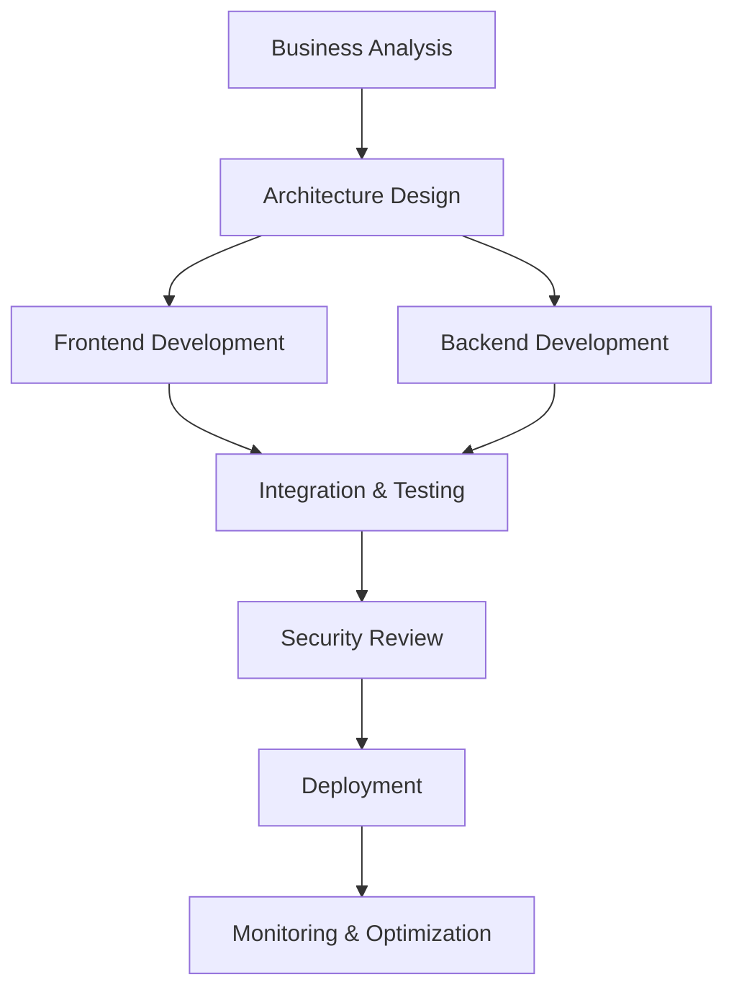

# My Name Is ClaudePilot

> Enterprise GitHub Copilot framework for software development lifecycle management

**Note**: This project is a derivative work of [My Name Is Claude](https://github.com/bartoszwarzocha/my_name_is_claude), adapted specifically for GitHub Copilot ecosystem.

[](https://opensource.org/licenses/MIT)
[](https://github.com/features/copilot)
[](https://github.com/features/copilot-enterprise)

## 📚 Table of Contents

- [🚀 Overview](#-overview)
- [✨ Key Features](#-key-features)
  - [🎯 Specialized Chatmodes (12)](#-specialized-chatmodes-12)
  - [📝 Expert Prompts (50)](#-expert-prompts-50)
  - [🔧 Technology Adaptive](#-technology-adaptive)
  - [🏢 Enterprise Features](#-enterprise-features)
- [🎯 Quick Start](#-quick-start)
- [📁 Framework Structure](#-framework-structure)
- [🎯 Usage Examples](#-usage-examples)
- [🔄 Migration from Claude Code](#-migration-from-claude-code)
- [🔄 Updating ClaudePilot from Source Project](#-updating-claudepilot-from-source-project)
- [🏢 Enterprise Adoption](#-enterprise-adoption)
- [📚 Learning Resources](#-learning-resources)
- [🤝 Contributing](#-contributing)
- [📄 Attribution](#-attribution)
- [📄 License](#-license)
- [🌟 Why Choose My Name Is ClaudePilot?](#-why-choose-my-name-is-claudepilot)

## 🚀 Overview

My Name Is ClaudePilot is a comprehensive GitHub Copilot framework designed for enterprise software development. It provides 12 specialized chatmodes and 50 expert-level prompts that adapt to your technology stack and guide you through the complete development lifecycle.

Built for enterprise teams who demand excellence, security, and compliance in their development processes.

## ✨ Key Features

### 🎯 Specialized Chatmodes (12)

#### Business & Strategy
- **business-analyst** - Requirements gathering, stakeholder management, process analysis
- **product-manager** - Product strategy, MVP planning, roadmap development
- **reviewer** - Quality assurance, validation, risk assessment

#### Architecture & Design
- **software-architect** - System architecture, technology selection, scalability planning
- **ux-designer** - User experience design, accessibility, design systems

#### Development
- **frontend-engineer** - UI development, responsive design, performance optimization
- **backend-engineer** - Server-side development, business logic, API integration
- **api-engineer** - API design, microservices, service integration
- **data-engineer** - Data architecture, ETL pipelines, analytics

#### Quality & Security
- **qa-engineer** - Test automation, quality processes, performance testing
- **security-engineer** - Security architecture, threat modeling, compliance

#### Operations
- **deployment-engineer** - DevOps, CI/CD pipelines, infrastructure automation

### 📝 Expert Prompts (50)

#### Agent Prompts (41)
Domain-specific expertise for focused development tasks:
- **API Development** (6): REST API design, GraphQL, microservices, Swagger generation
- **Architecture** (2): System architecture design, desktop application patterns
- **Business Analysis** (3): Requirements gathering, process analysis, business case development
- **Data Engineering** (4): Database design, ETL implementation, backend integration
- **Deployment** (2): CI/CD pipelines, desktop deployment and packaging
- **Design** (1): User research and persona development
- **Frontend** (12): React/Angular development, testing, accessibility, performance
- **Product** (3): Feature implementation, MVP scoping, user story management
- **QA** (1): Application performance optimization
- **Quality** (1): Test automation and quality assurance
- **Review** (2): Security vulnerability assessment, code quality analysis
- **Security** (7): Compliance, identity management, penetration testing, threat modeling

#### Workflow Prompts (7)
End-to-end process orchestration for complex projects:
- **GitHub Issue to Implementation** - Complete development workflow from issue analysis to production
- **PR Review to Deployment** - Automated deployment pipeline with risk assessment
- **Feature Development Lifecycle** - Full feature coordination across teams
- **Bug Fix Coordination** - Comprehensive incident response and resolution
- **Architecture Evolution Guidance** - System modernization and migration strategies
- **Cross-Chatmode Context Handoff** - Seamless transitions between specialized chatmodes
- **Enterprise Development Governance** - Compliance automation and quality gates

#### Init Prompts (2)
Project setup and configuration:
- **New Project** - Greenfield project initialization with best practices
- **Existing Project** - Onboarding to existing codebases with analysis

### 🔧 Technology Adaptive

Automatically adapts to your technology stack:

#### Frontend Technologies
- **React** - Hooks, context, performance optimization, testing strategies
- **Angular** - Components, services, reactive forms, NgRx state management
- **Vue.js** - Composition API, Vuex, component architecture
- **TypeScript/JavaScript** - Modern ES6+, type safety, best practices

#### Backend Technologies
- **Node.js/Express** - RESTful APIs, middleware, authentication, performance
- **Python/FastAPI** - Async APIs, dependency injection, data validation
- **Java/Spring Boot** - Enterprise patterns, security, microservices
- **.NET Core** - Clean Architecture, Entity Framework, dependency injection

#### Database Technologies
- **SQL Databases** - PostgreSQL, MySQL with optimization and migrations
- **NoSQL Databases** - MongoDB, Redis with appropriate patterns
- **ORM/ODM** - Entity Framework, Sequelize, Mongoose integration

#### Cloud Platforms
- **AWS** - Infrastructure as code, Lambda, ECS, RDS, S3
- **Azure** - App Service, Functions, SQL Database, Blob Storage
- **GCP** - Cloud Functions, Cloud SQL, Cloud Storage

### 🏢 Enterprise Features

#### Security & Compliance
- **OWASP Integration** - Automated security scanning and vulnerability detection
- **Regulatory Compliance** - SOC2, GDPR, HIPAA, PCI-DSS, ISO27001 validation
- **Threat Modeling** - Systematic security risk assessment
- **Audit Trails** - Comprehensive logging and change tracking

#### Quality Assurance
- **Enterprise Testing Framework** - Automated validation across all technology stacks
- **Performance Benchmarking** - Continuous performance monitoring and optimization
- **Code Quality Standards** - Automated enforcement of coding standards
- **Quality Gates** - CI/CD pipeline integration with zero-tolerance policies

#### Governance & Automation
- **GitHub Actions Integration** - Native CI/CD workflow generation
- **Automated Compliance Reporting** - Real-time compliance status and reporting
- **Risk Management** - Automated risk assessment and mitigation strategies
- **Change Management** - Controlled deployment processes with approval workflows

## 🎯 Quick Start

### 1. Setup Your Project

```bash
# Create your project directory
mkdir my-project
cd my-project

# Initialize Git repository
git init

# Copy the framework configuration
curl -O https://raw.githubusercontent.com/[repository]/main/copilot.instructions.md

# Commit the configuration
git add copilot.instructions.md
git commit -m "Add ClaudePilot framework configuration"
```

### 2. Configure Your Technology Stack

Edit `copilot.instructions.md` to match your project:

```markdown
## 0. Project Metadata
- **project_name**: your-project-name
- **primary_language**: typescript  # or python, java, csharp, etc.
- **business_domain**: your-domain  # ecommerce, fintech, healthcare, etc.
- **project_scale**: enterprise     # startup, sme, enterprise

## 3. Technologies
- **Frontend**: React, TypeScript, Material-UI
- **Backend**: Node.js, Express, PostgreSQL
- **Cloud**: AWS with Terraform
```

### 3. Start Development with Chatmodes

#### Basic Usage Pattern
```
# Start with business analysis
Switch to business-analyst chatmode

# Use specific prompts for focused tasks
@github .github/prompts/agents/business/stakeholder-requirements-gathering.prompt.md

# Follow guided transitions between chatmodes
Switch to software-architect chatmode
@github .github/prompts/agents/architecture/system-architecture-design.prompt.md
```

#### Advanced Workflow Orchestration
```
# Use workflow prompts for complex projects
@github .github/prompts/workflows/feature-development-lifecycle.prompt.md

# Context: New user authentication feature
# Epic coordination across multiple teams and chatmodes
```

### 4. Typical Development Flow



#### Phase-by-Phase Transitions
1. **Requirements & Strategy** - `business-analyst` → `product-manager` → `ux-designer`
2. **Architecture & Design** - `software-architect` → `security-engineer` → `data-engineer`
3. **Development** - `frontend-engineer` → `backend-engineer` → `api-engineer` → `qa-engineer`
4. **Deployment & Operations** - `deployment-engineer` → `security-engineer` → `reviewer`

## 📁 Framework Structure

```
.github/
├── chatmodes/              # 12 specialized chatmodes
│   ├── business-analyst.md
│   ├── software-architect.md
│   ├── frontend-engineer.md
│   └── ... (9 more chatmodes)
├── prompts/
│   ├── agents/            # 41 domain-specific prompts
│   │   ├── api/          # API development (6 prompts)
│   │   ├── frontend/     # Frontend development (12 prompts)
│   │   ├── security/     # Security engineering (7 prompts)
│   │   └── ... (8 more categories)
│   ├── workflows/        # 7 end-to-end orchestration prompts
│   ├── init/            # 2 project initialization prompts
│   ├── README.md        # Comprehensive prompts documentation
│   └── TESTING.md       # Enterprise testing framework
docs/
├── chatmode-workflow.puml  # PlantUML workflow diagram
examples/                   # Usage examples and real-world scenarios
├── desktop-book-writing-application.md
├── angular-invoice-system-migration.md
└── legacy-asp-net-modernization-tdd.md
work/                      # Migration and strategy documentation (optional)
copilot.instructions.md    # Project configuration template
```

### Note about `/work` Directory

The `/work` directory contains migration strategies and documentation from the original "My Name Is Claude" project. This directory is **optional** and can be safely removed if you:

- Only use My Name Is ClaudePilot (don't work with the original project)
- Don't need migration documentation and strategies
- Want to reduce project size

**Keep the `/work` directory if you:**
- Work with both My Name Is Claude and My Name Is ClaudePilot projects
- Need to update ClaudePilot based on changes in the original project
- Want access to migration strategies and implementation documentation

## 🎯 Usage Examples

### Example 1: New Feature Development
```
# Epic: User dashboard with analytics

# Phase 1: Business & Strategy
Switch to business-analyst chatmode
@github .github/prompts/agents/business/stakeholder-requirements-gathering.prompt.md
# → Define user needs, success metrics, acceptance criteria

Switch to product-manager chatmode
@github .github/prompts/agents/product/user-story-creation-and-prioritization.prompt.md
# → Create user stories, prioritize features, define MVP

# Phase 2: Architecture & Design
Switch to software-architect chatmode
@github .github/prompts/agents/architecture/system-architecture-design.prompt.md
# → Design system architecture, select technology stack

Switch to ux-designer chatmode
@github .github/prompts/agents/design/user-research-and-persona-development.prompt.md
# → Design user interface, create component specifications

# Phase 3: Implementation
Switch to frontend-engineer chatmode
@github .github/prompts/agents/frontend/react-component-development.prompt.md
# → Implement React components, state management, testing

Switch to backend-engineer chatmode
# → Implement API endpoints, business logic, database integration

# Phase 4: Quality & Deployment
Switch to qa-engineer chatmode
@github .github/prompts/agents/quality/test-automation-and-quality-assurance.prompt.md
# → Comprehensive testing, performance validation

Switch to deployment-engineer chatmode
@github .github/prompts/agents/deployment/ci-cd-pipeline-and-infrastructure-setup.prompt.md
# → Deploy to production with monitoring and rollback capabilities
```

### Example 2: Legacy System Migration
```
# Use advanced workflow orchestration
@github .github/prompts/workflows/architecture-evolution-guidance.prompt.md

# Context: Migrating monolithic application to microservices
# Systematic approach with risk mitigation and zero downtime
```

### Example 3: Security Implementation
```
Switch to security-engineer chatmode
@github .github/prompts/agents/security/security-architecture-and-threat-modeling.prompt.md

# Comprehensive security implementation with compliance validation
```

## 🔄 Migration from Claude Code

Upgrading from "My Name Is Claude" framework? Here's what's different:

### Key Changes
- **Agents → Chatmodes** - Manual chatmode switching instead of automatic agent transitions
- **GitHub Native** - Built specifically for GitHub Copilot Chat and GitHub Actions
- **Enhanced Workflows** - 7 comprehensive workflow prompts for complex orchestration
- **Enterprise Focus** - Built-in compliance, governance, and security automation

### Migration Steps
1. **Replace Configuration** - `CLAUDE.md` → `copilot.instructions.md`
2. **Update References** - Agent names → Chatmode names in documentation
3. **Adopt Workflow Prompts** - Use workflow prompts for complex multi-phase tasks
4. **Leverage GitHub Integration** - Utilize GitHub Actions workflows and native features

### Migration Benefits
- **Better Enterprise Support** - Comprehensive compliance and governance
- **Improved Quality Assurance** - Advanced testing and validation frameworks
- **Enhanced Security** - Built-in security scanning and threat modeling
- **Native GitHub Integration** - Seamless GitHub ecosystem integration

## 🔄 Updating ClaudePilot from Source Project

If you work with both projects and want to update My Name Is ClaudePilot based on changes in the original My Name Is Claude project:

### Prerequisites
- Both projects must be in the same parent directory
- Original project must have newer commits than ClaudePilot
- `/work` directory must be present (contains update strategies)

### Update Process
1. **Verify Setup** - Ensure both projects are accessible and properly positioned
2. **Use Update Prompt** - Apply the comprehensive update procedure:
   ```
   @github work/update_prompt.md

   Context: Update my_name_is_claudepilot based on latest changes in my_name_is_claude
   - Automatic change detection and analysis
   - Migration strategy application
   - Enterprise quality validation
   ```

3. **Review Results** - Check generated update summary and validation results

### What Gets Updated
- **New Chatmodes** - Converted from new agents using established migration patterns
- **Enhanced Prompts** - Adapted with GitHub Copilot optimizations and enterprise features
- **Updated Examples** - Rewritten using Copilot-native approach with comprehensive workflows
- **Documentation** - Enhanced with new capabilities while maintaining GitHub Copilot focus

### Quality Assurance
The update process includes:
- ✅ Comprehensive change analysis and impact assessment
- ✅ Automatic application of established migration strategies
- ✅ Enterprise quality validation and compliance verification
- ✅ Complete audit trail and documentation of all changes

## 🏢 Enterprise Adoption

### Security & Compliance
- **Zero Trust Security** - Built-in security scanning and validation
- **Regulatory Compliance** - Automated SOC2, GDPR, HIPAA, PCI-DSS validation
- **Audit Trail** - Comprehensive logging and change tracking
- **Risk Management** - Systematic risk assessment and mitigation

### Quality Assurance
- **Automated Testing** - Comprehensive test frameworks with >95% coverage requirements
- **Performance Standards** - Continuous performance monitoring and optimization
- **Code Quality** - Automated enforcement of enterprise coding standards
- **Quality Gates** - Zero-tolerance CI/CD pipeline integration

### Governance & Control
- **Change Management** - Controlled deployment with approval workflows
- **Compliance Reporting** - Real-time compliance status and automated reporting
- **Risk Assessment** - Continuous risk evaluation and mitigation strategies
- **Audit Support** - Complete audit trail and documentation

### Team Collaboration
- **Role-Based Chatmodes** - Clear separation of responsibilities and expertise
- **Context Preservation** - Seamless handoffs between teams and phases
- **Documentation Standards** - Automated documentation generation and validation
- **Knowledge Sharing** - Centralized patterns and best practices

## 📚 Learning Resources

### Getting Started
1. **[Quick Start Guide](.github/prompts/README.md)** - Comprehensive framework documentation
2. **[Testing Framework](.github/prompts/TESTING.md)** - Enterprise testing and validation
3. **[Workflow Examples](examples/)** - Real-world usage scenarios

### Advanced Usage
- **[Architecture Patterns](docs/chatmode-workflow.puml)** - System architecture workflows
- **[Migration Strategies](work/)** - Framework migration documentation
- **[Best Practices](.github/prompts/agents/)** - Domain-specific expertise

### Enterprise Features
- **Security Implementation** - Built-in security scanning and compliance
- **Quality Assurance** - Automated testing and performance validation
- **Governance** - Change management and audit trail systems

## 🤝 Contributing

We welcome contributions to improve the My Name Is ClaudePilot framework:

### Development Standards
- **Quality First** - All contributions must meet enterprise quality standards
- **Security Focus** - Security-first approach with automated scanning
- **Test Coverage** - Comprehensive testing requirements (>90% coverage)
- **Documentation** - Complete documentation for all features and changes

### Contribution Process
1. **Fork** the repository and create a feature branch
2. **Develop** following enterprise standards and patterns
3. **Test** comprehensively with automated validation
4. **Document** all changes and new features
5. **Submit** pull request with detailed description

### Code of Conduct
This project adheres to enterprise-grade professional standards with focus on:
- **Excellence** - Commitment to highest quality in all aspects
- **Security** - Security-first mindset in all contributions
- **Collaboration** - Professional and respectful team collaboration
- **Innovation** - Continuous improvement and adoption of best practices

## 📄 Attribution

**My Name Is ClaudePilot** is a derivative work based on the original "My Name Is Claude" project:

- **Original Project**: https://github.com/bartoszwarzocha/my_name_is_claude
- **Source Repository**: https://github.com/bartoszwarzocha/my_name_is_claude.git
- **Source Commit**: ed83359 "README.md updated"
- **Migration Date**: 2025-09-13
- **Relationship**: Complete adaptation and enhancement for GitHub Copilot ecosystem

This framework preserves the core concepts and expertise of the original Claude Code framework while being completely redesigned for GitHub Copilot's chatmode-based approach with enterprise-grade enhancements.

## 📄 License

MIT License - see [LICENSE](LICENSE) file for details.

Same license terms as the original "My Name Is Claude" framework, ensuring continuity and compatibility.

---

## 🌟 Why Choose My Name Is ClaudePilot?

### For Development Teams
- **Structured Approach** - Clear workflows and transitions between development phases
- **Technology Agnostic** - Works with your existing technology stack
- **Quality Assured** - Built-in testing and validation frameworks
- **Best Practices** - Industry-standard patterns and approaches

### For Enterprise Organizations
- **Compliance Ready** - Built-in regulatory compliance validation
- **Security First** - Comprehensive security scanning and threat modeling
- **Audit Trail** - Complete documentation and change tracking
- **Risk Management** - Systematic risk assessment and mitigation

### For GitHub Copilot Users
- **Native Integration** - Built specifically for GitHub Copilot Chat
- **Workflow Optimization** - Advanced prompt engineering for better results
- **Context Preservation** - Intelligent context handoff between chatmodes
- **Enterprise Features** - Professional-grade capabilities and governance

---

**Ready to transform your development process?**

Start with our [Quick Start Guide](.github/prompts/README.md) and discover how My Name Is ClaudePilot can revolutionize your software development lifecycle.

*Developed with enterprise excellence in mind. Built for teams who demand the best.*