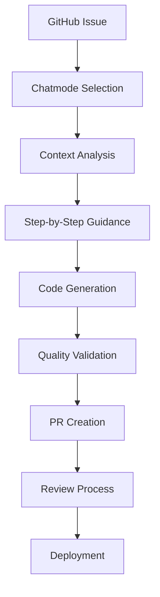

# Strategia Migracji Workflow Prompts - GitHub Copilot Native

## Meta Informacje
- **Data utworzenia**: 2025-09-13
- **Wersja**: 1.0.0
- **Zastosowanie**: Workflow Prompts i podobne kompleksowe orkiestracje
- **Status**: Obowiązująca strategia dla workflow-type promptów

---

## 1. Strategia "Przepisz Od Nowa" vs "Migruj Mechanicznie"

### Kiedy Stosować "Przepisz Od Nowa"

**ZAWSZE dla Workflow Prompts ponieważ:**
- Claude Code orchestracje są **fundamentalnie niezgodne** z GitHub Copilot architecture
- GitHub Copilot ma **inny model interakcji** (chatmodes vs agents)
- Copilot **nie ma tools** (Bash, Read, Write, Edit) używanych w orchestracjach
- Workflow w Copilot bazuje na **GitHub ecosystem** (Issues, PRs, Actions)

### Workflow Prompts - Specjalne Zasady Migracji

#### ❌ CO NIE PRZENOSIMY z Claude Code
- **Multi-agent orchestrations** - Copilot chatmodes działają niezależnie
- **Sequential tool calls** - Brak Bash, Read, Write, Edit tools
- **Automated file operations** - Copilot nie wykonuje automatycznych operacji na plikach
- **Complex state management** - Brak centralnego state management
- **Agent-to-agent communication** - Chatmodes nie komunikują się bezpośrednio

#### ✅ CO TWORZYMY NA NOWO dla GitHub Copilot
- **Context-aware guidance** - Inteligentne prowadzenie przez proces
- **GitHub-native workflows** - Issue → PR → Review → Merge
- **Chatmode transition patterns** - Smooth przejścia między chatmodes
- **IDE-integrated assistance** - Wsparcie bezpośrednio w IDE
- **Real-time code suggestions** - Context-aware code completion

---

## 2. Nowa Architektura Workflow dla GitHub Copilot

### GitHub Copilot Workflow Model



### Copilot-Native Workflow Patterns

#### 1. Context-Driven Workflows
```markdown
## Pattern: Context-Aware Guidance
ZAMIAST: Automatyczna orchestracja agents
TERAZ: Inteligentne prowadzenie z context awareness

Workflow Steps:
1. Analyze current context (copilot.instructions.md)
2. Detect development stage and requirements
3. Suggest optimal chatmode for current task
4. Provide step-by-step guidance with code examples
5. Enable smooth transitions to next chatmode
```

#### 2. GitHub-Integrated Workflows
```markdown
## Pattern: GitHub Ecosystem Integration
ZAMIAST: Custom workflow management
TERAZ: GitHub-native development process

Integration Points:
- GitHub Issues for task tracking
- GitHub Projects for workflow visualization
- GitHub Actions for automation
- GitHub PRs for code review
- GitHub Releases for deployment
```

#### 3. IDE-Centric Workflows
```markdown
## Pattern: IDE-Native Development
ZAMIAST: External tool orchestration
TERAZ: IDE-integrated development assistance

IDE Integration:
- Real-time code suggestions
- Context-aware completions
- Inline documentation generation
- Automated refactoring suggestions
- Error prevention and fixing
```

---

## 3. Nowe Workflow Prompts - Design Principles

### 7 Nowych Workflow Prompts (Copilot-Native)

#### 1. `github-issue-to-implementation.prompt.md`
**Cel**: Prowadzenie od GitHub Issue do gotowej implementacji
**Focus**: GitHub integration, context analysis, chatmode guidance
**Zamiast**: cross-team-development-coordination.md

#### 2. `pr-review-to-deployment.prompt.md`
**Cel**: Proces od PR review do deployment
**Focus**: Code quality, review automation, deployment guidance
**Zamiast**: architecture-design-to-development-handoff.md

#### 3. `feature-development-lifecycle.prompt.md`
**Cel**: Pełny cykl rozwoju feature
**Focus**: End-to-end development guidance, quality gates
**Zamiast**: new-feature-development-orchestration.md

#### 4. `bug-fix-coordination.prompt.md`
**Cel**: Koordynacja naprawy błędów
**Focus**: Debug guidance, fix validation, testing
**Zamiast**: critical-bug-fix-orchestration.md

#### 5. `architecture-evolution-guidance.prompt.md`
**Cel**: Ewolucja architektury projektu
**Focus**: Architecture decisions, migration guidance
**Zamiast**: business-requirements-to-architecture-handoff.md

#### 6. `cross-chatmode-context-handoff.prompt.md`
**Cel**: Inteligentne przejścia między chatmodes
**Focus**: Context preservation, smooth transitions
**Zamiast**: Brak odpowiednika (nowy concept)

#### 7. `enterprise-development-governance.prompt.md`
**Cel**: Governance dla enterprise development
**Focus**: Compliance, standards, quality assurance
**Zamiast**: epic-breakdown-orchestration.md

### Design Principles dla Każdego Workflow Prompt

#### A. Context Analysis Framework
```yaml
context_analysis:
  project_context: "Read copilot.instructions.md"
  github_context: "Analyze Issues, PRs, Projects"
  code_context: "Understand current codebase state"
  team_context: "Detect team size and workflow preferences"
```

#### B. GitHub Integration Points
```yaml
github_integration:
  issues: "Task tracking and assignment"
  projects: "Workflow visualization"
  actions: "Automation and CI/CD"
  pull_requests: "Code review and collaboration"
  releases: "Deployment and versioning"
```

#### C. Chatmode Ecosystem Integration
```yaml
chatmode_integration:
  entry_points: "How to enter this workflow"
  transition_guidance: "When and how to switch chatmodes"
  context_handoff: "What context to preserve"
  completion_criteria: "When workflow is complete"
```

#### D. Quality Gates & Standards
```yaml
quality_standards:
  code_quality: "Automated quality checks"
  security: "Security validation at each step"
  performance: "Performance considerations"
  documentation: "Documentation requirements"
```

---

## 4. Implementation Strategy

### Faza 1: Design & Architecture
1. **Analiza oryginalnych workflow prompts** - Jedynie jako inspiracja
2. **Design nowej architektury** - Copilot-native approach
3. **Mapowanie funkcjonalności** - Co zostaje, co się zmienia
4. **GitHub integration planning** - Jak zintegrować z GitHub ecosystem

### Faza 2: Implementation
1. **Utworzenie YAML headers** - Zgodnie z Copilot standards
2. **Context Analysis Framework** - Inteligentna analiza kontekstu
3. **Technology Detection** - Multi-language support
4. **GitHub Integration** - Native GitHub workflows
5. **Code Generation Templates** - Production-ready patterns
6. **Quality Gates** - Enterprise-grade standards
7. **Transition Guidance** - Smooth chatmode transitions
8. **Examples & Use Cases** - Praktyczne przykłady

### Faza 3: Validation & Testing
1. **Workflow testing** - Testowanie każdego workflow
2. **Context validation** - Sprawdzenie context analysis
3. **GitHub integration testing** - Testy integracji z GitHub
4. **Enterprise validation** - Sprawdzenie enterprise requirements

---

## 5. Migration Quality Standards

### Dla Workflow Prompts - Specjalne Wymagania

#### A. Context Intelligence
- **Automatic context detection** z copilot.instructions.md
- **GitHub state awareness** - Issue status, PR state, etc.
- **Code context understanding** - Current implementation state
- **Team workflow adaptation** - Dostosowanie do team preferences

#### B. GitHub Ecosystem Integration
- **Native GitHub workflows** - Wykorzystanie GitHub features
- **Actions integration** - Automated workflow steps
- **Project management** - GitHub Projects integration
- **Collaboration features** - Team coordination through GitHub

#### C. Enterprise Governance
- **Compliance frameworks** - SOX, SOC2, GDPR compliance
- **Security standards** - Security gates w workflow
- **Quality assurance** - Automated quality checks
- **Audit trails** - Pełna audytowalność workflow

#### D. Technology Adaptation
- **Multi-language support** - Wszystkie wspierane języki
- **Framework awareness** - React, Angular, Spring Boot, etc.
- **Deployment adaptation** - Docker, Kubernetes, Cloud
- **Testing integration** - Automated testing workflows

---

## 6. Success Criteria

### Workflow Prompts - Measures of Success

#### Functional Success
- [ ] **Context awareness** - Inteligentne rozpoznawanie kontekstu
- [ ] **GitHub integration** - Pełna integracja z GitHub ecosystem
- [ ] **Chatmode transitions** - Smooth przejścia między chatmodes
- [ ] **Code quality** - Enterprise-grade code generation
- [ ] **Team collaboration** - Effective team coordination

#### Technical Success
- [ ] **Performance** - Fast context analysis and suggestions
- [ ] **Scalability** - Works for startup to enterprise scale
- [ ] **Maintainability** - Easy to understand and modify
- [ ] **Security** - Secure workflow patterns
- [ ] **Compliance** - Enterprise compliance standards

#### User Experience Success
- [ ] **Intuitive workflows** - Easy to follow and understand
- [ ] **Minimal cognitive load** - Clear guidance without overwhelm
- [ ] **Actionable suggestions** - Specific, implementable recommendations
- [ ] **Context preservation** - Smooth information flow
- [ ] **Learning curve** - Quick adoption for teams

---

## 7. Template Structure dla Workflow Prompts

### Standardowa Struktura (Copilot-Native)

```markdown
---
name: workflow-name
description: Brief description of workflow purpose
tools: [github-copilot, github-integration, workflow-automation]
model: github-copilot
context_adaptation: true
workflow_type: true
---

# Workflow Name - GitHub Copilot Integration

## Context Analysis Framework
[Automatic context detection and analysis]

## GitHub Integration Points
[Native GitHub ecosystem integration]

## Workflow Stages
[Step-by-step workflow guidance]

## Chatmode Transition Framework
[Intelligent chatmode switching]

## Quality Gates & Standards
[Enterprise-grade quality assurance]

## Examples & Use Cases
[Practical workflow examples]
```

---

## 8. Maintenance & Evolution

### Long-term Strategy
- **Regular updates** - Keep workflows current with GitHub features
- **Community feedback** - Incorporate user feedback and improvements
- **Technology evolution** - Adapt to new languages and frameworks
- **Enterprise requirements** - Evolve with enterprise governance needs

### Version Control
- **Semantic versioning** - Clear versioning for workflow prompts
- **Migration guides** - When workflow patterns change
- **Backward compatibility** - Maintain compatibility where possible
- **Deprecation strategy** - Clear deprecation path for old patterns

---

**WAŻNE**: Ta strategia obowiązuje dla **wszystkich workflow-type promptów** oraz podobnych kompleksowych orkiestracji. Zawsze przepisywać od nowa z optymalizacją pod GitHub Copilot ecosystem.

*Dokument będzie aktualizowany w miarę rozwoju workflow patterns i pojawiania się nowych GitHub Copilot features.*